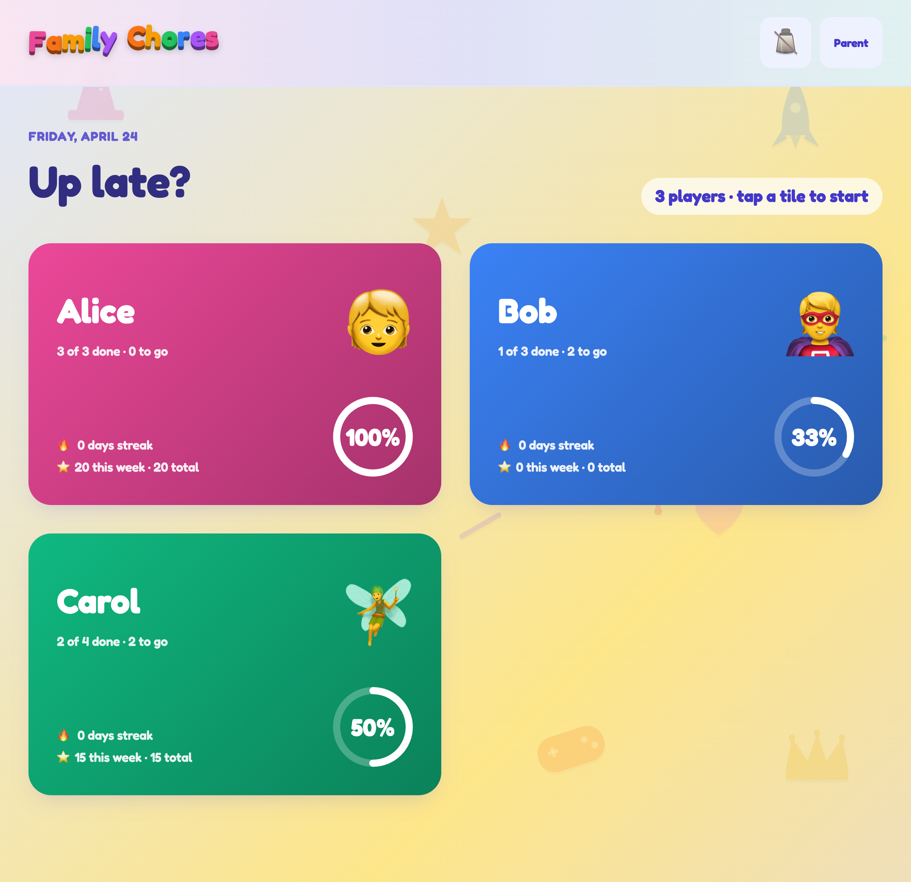
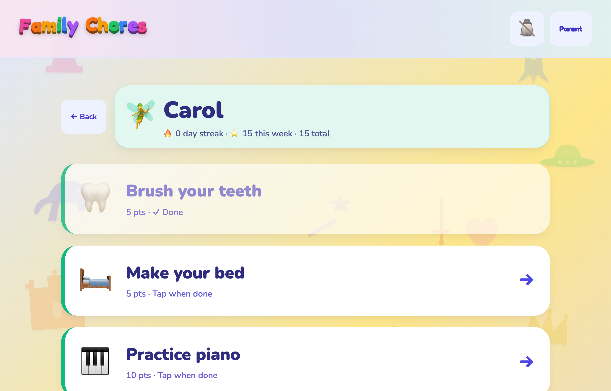
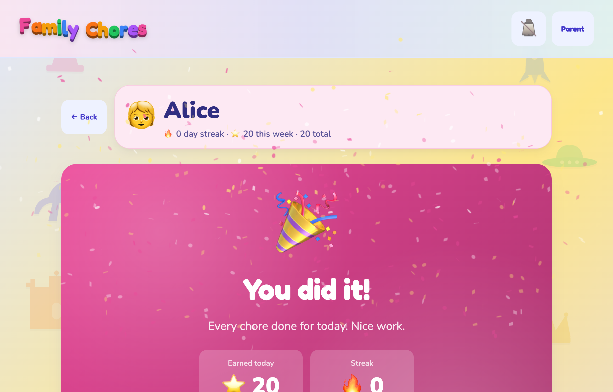
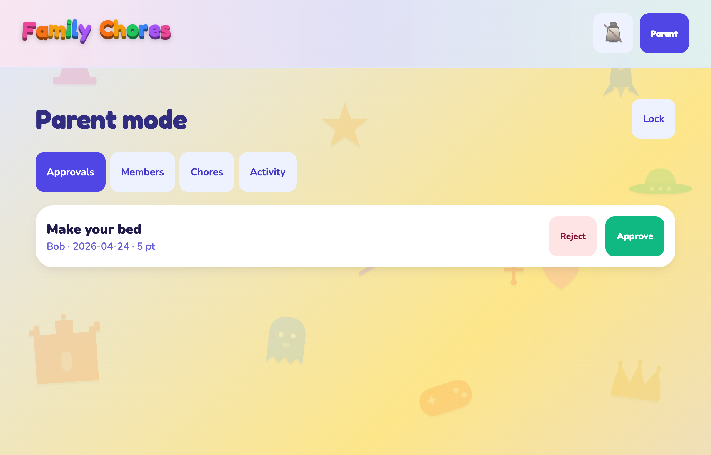
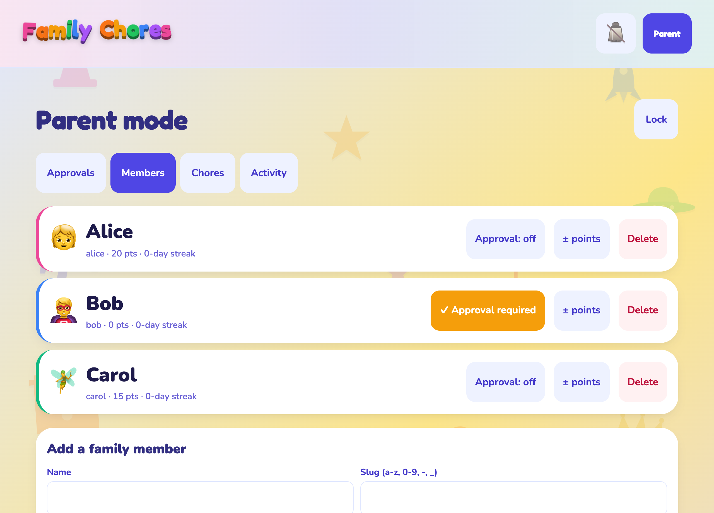
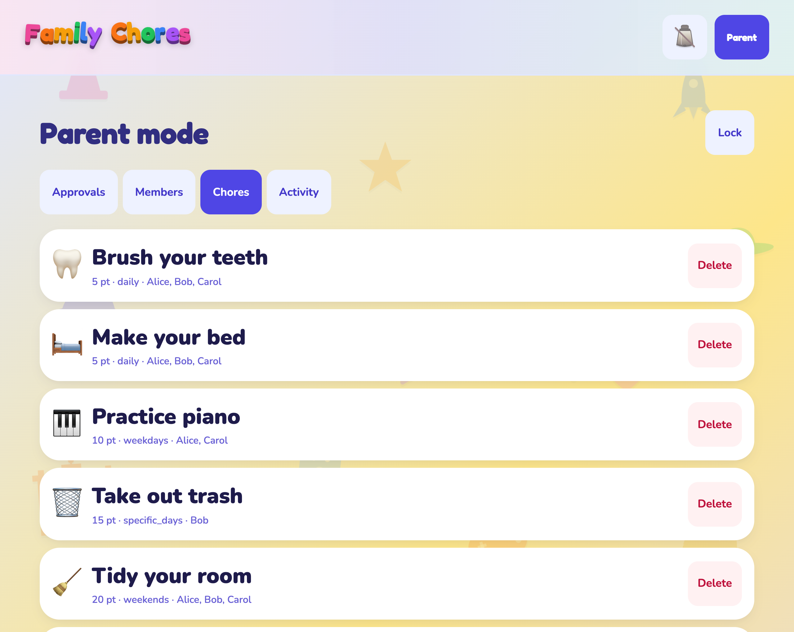
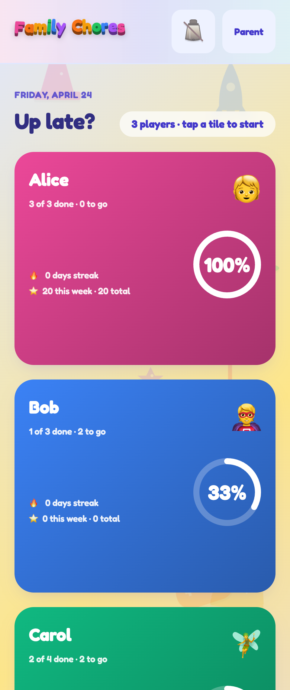

# Family Chores

Family chore tracking and rewards, self-hosted inside [Home Assistant](https://www.home-assistant.io/). Runs as a Supervisor-managed add-on with an Ingress-served web UI tuned for a wall-mounted tablet, and publishes chore state as regular HA entities so you can automate against it or display it on any dashboard. An optional Lovelace card ships separately for dashboard widgets.

## Why

Chore apps that live outside HA force families to juggle another service, another login, and another set of notifications. This add-on keeps everything inside HA's trust boundary and publishes chore state as regular entities so you can automate ("if Alice's streak breaks, blink the hall light"), display on any dashboard, or hook into Voice.

## Screenshots

> Captured from a synthetic dev install (no real family data). The
> Home-Assistant-disconnected banner that normally sits at the top in
> dev mode is hidden here for clarity.

  

The **Today view** is the landing page on the wall-mounted tablet: one
tile per family member, a fluid-typography progress ring, and the
weekly + lifetime point totals. The greeting up top is contextual
("Good morning" / "Up late?"). Tap a tile to drop into that kid's
chore list.

<table>
<tr>
<td width="50%">

 
<b>Member view (kid)</b> — one-tap completion, 72px minimum tap
targets, faded-green cards for already-done chores. Each member's
screen is themed with their personal accent colour (Carol = green
fairy ✨). Slow background shift reduces image-retention on the
wall-mounted tablet.
</td>
<td width="50%">

 
<b>All-done celebration</b> — fires a fresh confetti burst when
the last chore of the day flips to done. Web Audio chime (A5 → C#6
two-note bell, no binary asset) plays alongside if the sound toggle is
on.
</td>
</tr>
<tr>
<td width="50%">

 
<b>Parent — approval queue</b> — members with
<code>requires_approval: true</code> mark chores as
<code>done_unapproved</code> on completion; points aren't awarded
until a parent approves. Reject sends it back to pending with an
optional reason recorded in the activity log.
</td>
<td width="50%">

 
<b>Parent — manage family</b> — add/edit/remove members, toggle
the per-member approval flag, manually adjust points (with audit-log
trail), and link each member to a Local-Todo entity in HA for
two-way sync.
</td>
</tr>
<tr>
<td width="50%">

 
<b>Parent — chore catalog</b> — seven recurrence rules supported
(daily, weekdays, weekends, specific weekdays, every-N-days,
monthly-on-date, once). Creating or editing a chore regenerates
today's instances inline so a newly-added chore shows up
immediately — no waiting for the midnight rollover.
</td>
<td width="50%">

 
<b>Phone / portrait viewport</b> — the same Today view scales
fluidly from a 32" wall-mounted portrait panel down to a phone, with
member tiles stacking vertically below ~640px. Typography uses
<code>clamp()</code>-based tokens; no discrete breakpoints.
</td>
</tr>
</table>

## Features

- **Unlimited family members** — each with avatar, colour theme, and an "always approved" vs. "requires parent approval" mode.
- **Seven recurrence rules** — daily, weekdays, weekends, specific days of the week, every N days (with anchor), monthly-on-date, one-off. DST-safe.
- **Points + streaks + weekly totals**, with HA events fired on completion, approval, and streak milestones so you can wire automations (blink a light, play a Sonos cue, TTS, etc.).
- **Kid-friendly tablet UI** — one-tap completion, 72px minimum tap targets, 4-second undo toast, confetti + chime on completion, per-member colour themes.
- **Parent mode behind a PIN** — approvals queue, chore catalogue, member management, activity log, manual point adjustments.
- **HA entity mirror** — `sensor.family_chores_<member>_{points,streak,today_progress}`, a global `sensor.family_chores_pending_approvals`, and optional per-member Local To-do sync.
- **Lovelace card** (optional) — a single-file (~26 KB) Lit component that reads the mirrored entities and shows per-member progress on any HA dashboard.

See the [add-on documentation](family_chores/DOCS.md) for the full entity catalogue, event schema, and configuration options.

## Install

- **Home Assistant users** — see [`INSTALL.md`](INSTALL.md) for step-by-step instructions (custom add-on repository or local `addons/` folder).
- **Lovelace card** — see [`lovelace-card/README.md`](lovelace-card/README.md).

## How it fits together

- **SQLite inside the add-on** is the source of truth for members, chores, and completions.
- The add-on **mirrors** state into HA entities via the Supervisor-proxied REST API — one-way write, never reads state back for decisions.
- The **Ingress-served React SPA** is the primary interface, designed for a wall-mounted tablet.
- The separate **Lovelace card** is a read-only dashboard widget; it subscribes to the mirrored entities.

For the monorepo layout, the dependency direction between shared `packages/` and deployment-target `apps/*`, and the authentication strategy split, see [`docs/architecture.md`](docs/architecture.md).

## Threat model

Please read this before opening your Home Assistant instance to family or guests:

- The add-on runs **inside HA's trust boundary**. Anyone who can reach HA can reach this add-on. Use HA's own authentication as your real access control.
- The **parent PIN is a soft lock**, not a security boundary. It exists to stop a curious kid from hitting "delete member" from the tablet. Do not treat it as protection against a motivated attacker.
- Uploads are re-encoded through Pillow to strip metadata and enforce size limits.
- Logs never contain PIN hashes, JWTs, or the Supervisor token.

For private vulnerability reports, see [`SECURITY.md`](SECURITY.md).

## Documentation map

- [`INSTALL.md`](INSTALL.md) — installation (custom repository or local folder), configuration, HA To-do setup, uninstalling.
- [`family_chores/DOCS.md`](family_chores/DOCS.md) — add-on store documentation: entities, events, troubleshooting, Lovelace card integration.
- [`family_chores/CHANGELOG.md`](family_chores/CHANGELOG.md) — per-release notes.
- [`lovelace-card/README.md`](lovelace-card/README.md) — Lovelace card install and configuration.
- [`docs/architecture.md`](docs/architecture.md) — monorepo layout, dependency direction, authentication strategies.
- [`docs/roadmap.md`](docs/roadmap.md) — what's planned, what's on the radar, what's explicitly out of scope.
- [`DECISIONS.md`](DECISIONS.md) — running design journal. The "why" behind every non-obvious choice.

## Contributing

Pull requests welcome — start with [`CONTRIBUTING.md`](CONTRIBUTING.md), which covers dev setup, per-package test commands, and PR expectations. For architectural changes read [`DECISIONS.md`](DECISIONS.md) and [`docs/architecture.md`](docs/architecture.md) first — the `packages/` → `apps/*` dependency direction is enforced in CI and won't bend.

By participating in this project you agree to abide by the [Code of Conduct](CODE_OF_CONDUCT.md).

## License

[MIT](LICENSE) © 2026 Jason Patton
